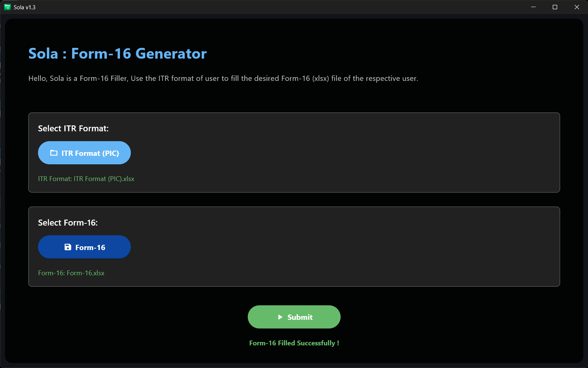
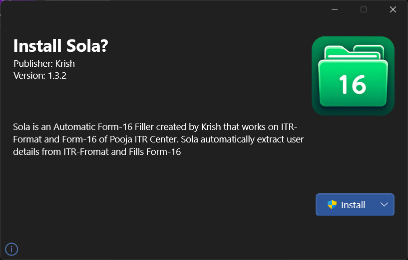

# Sola - *Form-16 Generator* ✅

## Overview 🕶️

Sola is a software tool designed to automate the filing of Form-16 using the ITR Format. It simplifies the process of creating Form-16. The software extracts user data from their ITR-Format and Fills a pre-made Form-16 template. To use the software, you will require the `ITR-Format` and `Form-16` templates, which are not shared with the software.

> [!WARNING]
The software is created for **Pooja ITR Centre**, and is publicly available for use, but the Excel sheets like ITR-Format and Form-16 are kept private. Therefore, these sheets are not shared with this or any other software. **Without the Sheet, Sola is a useless software !!**

---

### Sola Interface

Here is how the sotware looks like



### Sola Installer

A modern installer for a rich installation fell



---

## Features ✨

- Extracts details from ITR format ( `.xlsx` file ).
- Fills Form-16 ( `.xlsx` file ) automatically.
- User-friendly interface for file selection and output generation.
- Modern UI
- Can be compiled to aweb app, a desktop app or an apk.

## Installation ⬇️

To install the software, you can download the latest release of the software from the release section of this repository.

## Build ⚙️

To build the application from scratch for Windows, run the following command:

> [!NOTE]
> Make sure you have `git` installed on your system.
> You can type `git -v` directly into your console; if no error is shown, `git` is installed on your system.

```powershell
git clone --no-checkout https://github.com/Krishna-Noutiyal/ITR-Kit.git
cd ITR-Kit
git sparse-checkout init
git sparse-checkout set capital_gain_calculator
git checkout main
```

Head to the form-16_generator folder and run the build command:

```powershell
.\build.ps1 -i
```

The build script will automatically install the required packages and start the build. The finished build will be present in the `build\windows` directory.

## Usage ⚒️

For using Sola, you will need the ITR-Format and Form-16 template **( Not included with the software )**. But let's say you have the required documents, then here is how you use Sola:

1. Launch the application.
2. Select the ITR Format.
3. Select the Form-16.
4. Click "Submit" to fill out the Form-16.

> [!NOTE]
> The relevant details required to fill the **Form-16** are going to be automatically taken by Sola. Therefore, make sure you fill in the **ITR-Format** correctly before running Sola.

## File Structure 📂

The structure of the project is as follows :

- **assets**: Contains the icon file for building Sola and other assets for this repo.
- **config**: Colour configurations of Sola.
- **icons**: Software Icons used in Builds. The `assets\icon.png` file is the latest version of the icon present in this directory.
- **routes**: Routes of the software and pages configuration.
- **scripts**: Internal scripts used by Sola for its work.
- **ui**: The Front-end user interface of the software.
- **`README.md`**: The thing you are reading now.
- **`./build.ps1`**: The build script of Sola. Also used to install requirements.
- **`./main.py`**: The main file that starts the execution of Sola.
- **`./myproject.toml`**: Details of Sola project.
- **`./requirements.txt`**: Packages required by Sola.

## Dependencies 🚴

- Python 3.9+
- Flet
- OpenPyXL
- Pandas
- Toml

## Sponsors and Funding 💰

The project is fully sponsored by **Pooja ITR Centre**, which provides all necessary funding. As a result, **Pooja ITR Centre** holds exclusive rights to the software.
